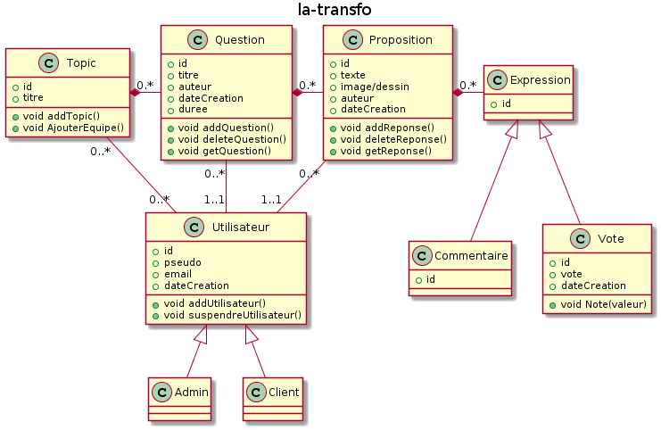

# PROJET : la-transfo

## Qu'est-ce que c'est ?
Une plateforme qui permet de dynamiser la réflexion.

## Organisation
- [Trello](https://trello.com/b/YxZwMFFv/la-transfo)

## Manuel d'utilisation
### Application mobile
1. Suivre la consigne d'installation de Ionic 2 : [Lien](http://ionicframework.com/docs/v2/intro/installation/)
2. Ouvrir une fenêtre de commande
2. Se déplacer dans laTransfo\laTransfo-App
3. Lancer la commande : *ionic serve*

### API

1. Créer un objet : POST (http://adresse/objet)
2. Consulter tous les objets : GET (http://adresse/objet)
3. Consulter un objet grâce à son id : GET (http://adresse/objet/identifiant)
4. Supprimer un objet grâce à son id : DELETE (http://adresse/objet/identifiant)
5. Mettre à jour un objet grâce à son id : PUT (http://adresse/objet/identifiant)

## UML
### Diagramme de classes

---

## Contributeurs
-